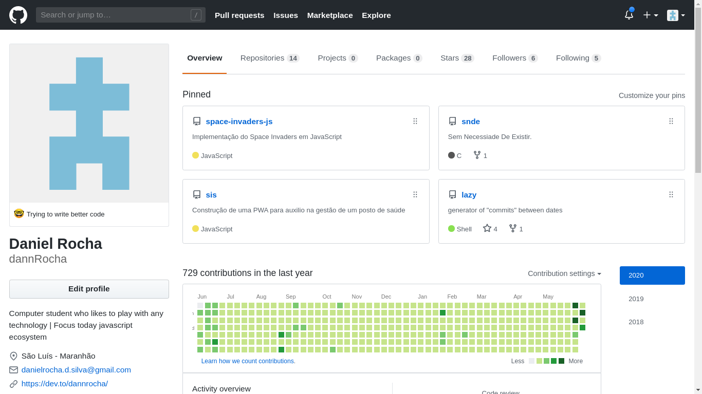

# :trollface: Lazy

**Artigo:** [Deixando suas contribuições "verde"](https://dev.to/dannrocha/deixando-o-suas-contribuicoes-verde-55ml)

O script gera um repositório e o preenche com ***commits*** entre datas passadas por argumento


## Porquê?

Mais um dia se passava e eu estava ouvindo alguns podcasts BR de desenvolvimento, e teve um episódio que falava sobre como os blocos "verde" no perfil de usuários do github estava sendo usado como uma certificação que o desenvolvedor produz algo (não estava parado fazendo nada), um dos integrantes do podcast informou que esse meio de filtro de contratação é meio furada e deu a ideia que podia ser feito um script que preenchesse o quadro verdinho do perfil do github.

    -- Eu fazendo "nada", pensei (...), 
    -- UHHHUMMMMMMMM!, porquê não?

E assim surgiu esse script, meio incompleto, que gera um falso trabalho entre um período determinado pelo usuário.


## Modo de uso

Só funciona em um interpretador shell script

#### Dependências
*   ***git***: é um sistema de controle de versão distribuído de código
*   ***date*** : comando de data
*   ***touch***: comando para criação de arquivos
*   ***cut***: manipulador de string

Acho que é normal o ***date***, ***touch*** e ***cut*** já esteja pré-instalado em distro linux, mas fica a observação

#### Obtendo o repositório

Clonando o repositório
```sh
git clone git@github.com:dannRocha/lazy.git
```

Ou você pode copia a raw do script, baixar compactado, você escolhe o meio de obter o script

#### Gerando repositório "falso"

Antes de iniciar o script dê permissão de execução
```sh
chmod +x lazy.sh
```
Agora vamos criar nosso repositório. Na pasta do script chame o com os seguintes parâmetros

```sh
./lazy.sh "date from" "date to" "repository name"
```
Exemplo:
```sh
./lazy.sh "09 jun 2019" "07 jun 2020" "lazy-work"   
```
Pra ficar mais **realista** use o parâmetro ***-s***. 
```sh
./lazy.sh -s "09 jun 2019" "07 jun 2020" "lazy-work"   
``` 

Observe que as datas tem o seguinte padrão "**day** **month** **year**". O dia tem que ser um número e um dia existente, o mês tem que ser passado por extenso ou com abreviação em inglês, e o ano tem que ser passado completo ( 2020 ). O nome do repositório é opcional, caso não seja passado um nome, o repositório é nomeado como "green". Há mais opções no script, você pode verificar passando o parâmetro ***--help*** ou ***-h***.


Se você for muito doido, pode deixar o script global no sistema.

```sh
./lazy --install or ./lazy -i
```

## Conclusão

Após finalizar a criação do repositório, suba o projeto para o github e veja um milagre acontecer.
    
    -- "kkkkkkkkkkkkkkkkkkkk"


#### Antes

#### Depois


#### Com o parâmetro *-s*


Esse mini projeto me deu uma oportunidade de aprender mais sobre o git, comandos do linux e também das maravilhas que o shell script(que nunca usei antes) pode fazer sem muita complicação (primeiro automação).

